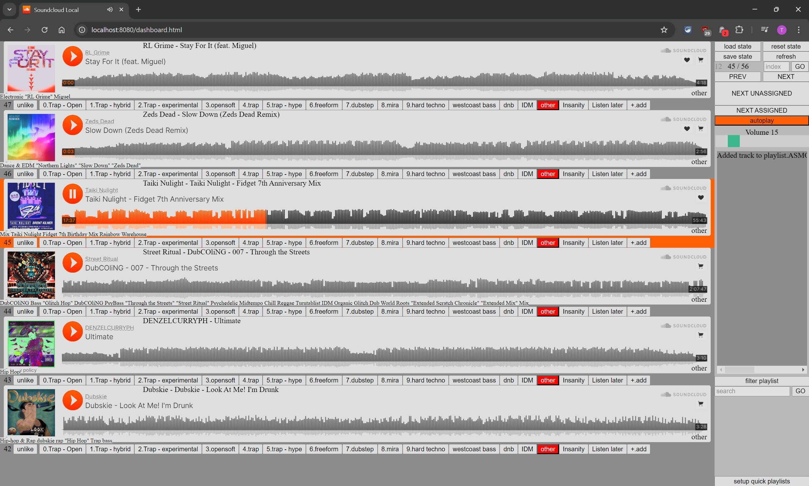

# [Soundcloud Local](https://github.com/ta946/Soundcloud-Local)

interact with soundcloud on a custom website that speeds up the process of listening to tracks, adding to playlists and downloading

for first time setup, follow the instructions on this page. [setup](./docs/setup.md)

## Usage

**WARNING! DO NOT MAKE ANY CHANGES DIRECTLY IN SOUNDCLOUD WHILE YOU ARE USING THIS PROGRAM!**

Setting playlists overwrites the playlist in soundcloud. if you add tracks in soundcloud directly, you can end up removing the track from the playlist!

Always make sure the current "state" of the program is up-to-date before you start using it by pressing `reset state`

* Run the program
	1. WINDOWS: run `run_sc.bat`
	1. MACOS: run `run_sc.sh`
* Press `reset state` to fetch all your likes and store the "state" in memory
* you can save the state on your computer by pressing `save state`, and load it again with `load state`. only do this if you need to close the program and open it up again and you are sure you have not made any changes in soundcloud directly!
* you can see the current index of your liked track, it is numbered in reverse, `0` being your latest track
* `index` input box lets you jump to a track if you know its index
* `NEXT UNASSIGNED` will jump to the next track that has not been added to any playlists
* `NEXT ASSIGNED` will jump to the next track that is in a playlist
* `filter playlist` will only show tracks in a selected playlist.
	* click `refresh` to return to normal likes view
* `search` will search the track name, artist name and tags.
	* click `refresh` or search with empty input to return to normal likes view
* `setup quick playlists` will allow you to drag and drop playlists into the "selected" section to add them as buttons below the tracks
	* this website was designed to work with only 1 row of quick playlists, otherwise it will scroll around and be annoying. just use the `add` button under a track to add to any playlist
* the bottom right of a track shows the playlists it is currently added to. the playlist buttons will also be colored red
* the bottom left of a track shows the "tags" (ie genres) the artist has added
* top right will show an arrow facing down when the track is available for direct download from soundcloud (doesn't always work) or a trolley icon that will take you to their buy website

## workflows

#### Categorizing likes into playlists
* adding tracks to playlists in soundcloud is very slow and annoying
* this program lets you go through your likes faster by letting you seek (small or big jumps, or to specific section using the hotkeys)
* see which playlists a track is already in at the bottom right of the track
* easily go to the "next unassigned" track which is not in any playlist
* easily add your tracks to a playlist by using the quick playlist buttons or hotkeys. or by clicking the `+.add` button (or `+` hotkey) to add to any playlist

#### Searching for songs
* soundcloud takes so long to search through your likes
* this program lets you instantly search your likes by checking track name, artist name and tags
* its even faster if you've already saved the "state" previously and load the old state if its not a track you've added recently

#### Downloading tracks
* if you open too many tracks too fast on soundcloud, it will block you from loading the pages, even if all you want is the download/buy button
* this program lets you load as many tracks as you want, and will display a button on the top right of a track with a link
* if the link shows a arrow facing down, its a direct download from soundcloud (which can sometimes be limited and wont work)
* if the link shows a trolley icon, its a link to ther buy website

## Hotkeys

* **SPACE**: pause / play
* **A / D**: seek forward/backward
* **shift + A / D**: large seek forward/backward
* **S / down**: next track
* **W / up**: previous track
* **control + down**: jump to next unassigned track
* **shift + S / down**: volume down
* **shift + W / up**: volume up
* **0 - 9**: add to quick playlist
* \+: add to any playlist
* \-: unlike track
* **shift + 0 - 9**: seek to section of track
* **control**: hide alert banner
